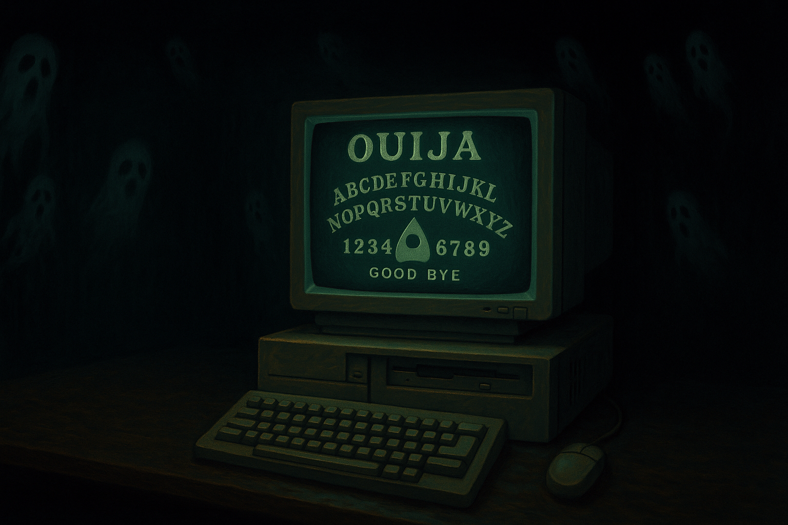

## Description

Players will be given an .exe which will pretend to be a Ouija board program.
Players will be able to ask and receive questions from the 'ghost', and if they can answer 3 questions right (by reverse engineering the program), they will receive the flag.

The answers will be fairly obvious to anyone looking in the disassembly-- there will be direct comparisons, and so visible immediately in most decompilers, and  answers will be visible in .data, so between cursory glances at in Ghidra and the 'strings' command, you should be able to find everything.

The flag itself is hidden in a simplistic double-XOR’d array, slightly obfuscated by being placed next to several other xor’d arrays. It will be decrypted when the player answers all 3 questions correctly.

‌

‌

Points: **100**
Created by: @spiffylich / GlitchKraken
Dependency: N/A
Attempts: N/A

## Challenge

> We went to one of the meetup spots DEADFACE often uses, and found an old floppy disk lying next to one of the older public computers… given the theme,  we think spookyboi may have left it there intentionally. We managed to scrape this program off of it, and expect it will give us info on the next meetup location. I can’t seem to get anything useful out of it, and to be honest, the whole program gives me the ick!
>
> [Download OUIJA.zip](https://tinyurl.com/hpcke27u "‌")

## Solution

Players will need to dig through the binary in a RE tool such as Ghidra to determine the correct answers for the 'ghost'

**Question 1.)** Observing the first called function by main will show a looping menu.
this menu asks for an admin pw to continue, and does a direct comparison to the string “`I_1NVIT3_Y0U_1N`“ before calling the next stage.

.png)

**Question 2.)**

Players will be asked 'What is your name?', and the program will only accept **the name of the terminal user** they are logged in as. As an example, by default on Ubtuntu, without a proper user setup, the username is ubuntu, and this would be the expected username. To do this, getlogin() is called, and compared against user input.

This will require more effort, as users will need to guess, or understand the functionality of getlogin().

.png)
‌

**Question 3.)**

Lastly, the ghost will appear before the user, and tell them to ask it one question. the only accepted answer is **'what is the flag'** exactly as shown.

there is a place before this where the string is constructed in memory, and is fairly visible via ghidra with a little digging.

‌

.png)

.png)

‌

Of course, there’s nothing preventing the user from playing around with the correct phrase here, either-- the code will chop off any '?' input, so the there is some slight leniency.

.png)

## Flag

deadface{`C0D3D_1N_BL00D_THE_GH05T_4W4K3N5`}